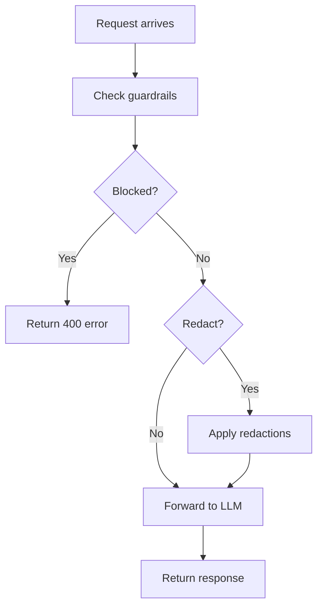

## Overview

LLM Gateway includes **enterprise-grade guardrails** to protect your applications from harmful content, data leaks, and policy violations. Available on Enterprise plans.

<Note>
Guardrails require an **Enterprise plan**. Contact us at contact@llmgateway.io to upgrade.
</Note>

## System Rules

Built-in detection for common security threats:

```typescript apps/api/src/routes/guardrails.ts
const systemRules = [
  {
    id: "system:prompt_injection",
    name: "Prompt Injection Detection",
    category: "injection",
    defaultEnabled: true,
    defaultAction: "block"
  },
  {
    id: "system:jailbreak",
    name: "Jailbreak Prevention",
    category: "jailbreak",
    defaultEnabled: true,
    defaultAction: "block"
  },
  {
    id: "system:pii_detection",
    name: "PII Detection",
    category: "pii",
    defaultEnabled: true,
    defaultAction: "redact"
  },
  {
    id: "system:secrets",
    name: "Secrets Detection",
    category: "secrets",
    defaultEnabled: true,
    defaultAction: "block"
  },
  {
    id: "system:file_types",
    name: "File Type Restrictions",
    category: "files",
    defaultEnabled: true,
    defaultAction: "block"
  },
  {
    id: "system:document_leakage",
    name: "Document Leakage Prevention",
    category: "document_leakage",
    defaultEnabled: false,
    defaultAction: "warn"
  }
];
```

## Actions

Guardrails can take four actions:

- **block** - Reject the request completely
- **redact** - Remove sensitive content and continue
- **warn** - Log violation but allow request
- **allow** - Bypass the rule

## Configuration

Configure guardrails via the API:

### Get Current Configuration

```bash
curl "https://api.llmgateway.io/guardrails/config/org_abc123" \
  -H "Authorization: Bearer YOUR_SESSION_TOKEN"
```

Response:

```json
{
  "id": "config_xyz",
  "organizationId": "org_abc123",
  "enabled": true,
  "systemRules": {
    "prompt_injection": {
      "enabled": true,
      "action": "block"
    },
    "jailbreak": {
      "enabled": true,
      "action": "block"
    },
    "pii_detection": {
      "enabled": true,
      "action": "redact"
    },
    "secrets": {
      "enabled": true,
      "action": "block"
    },
    "file_types": {
      "enabled": true,
      "action": "block"
    },
    "document_leakage": {
      "enabled": false,
      "action": "warn"
    }
  },
  "maxFileSizeMb": 10,
  "allowedFileTypes": [".pdf", ".txt", ".docx"],
  "piiAction": "redact"
}
```

### Update Configuration

```bash
curl https://api.llmgateway.io/guardrails/config/org_abc123 \
  -X PUT \
  -H "Authorization: Bearer YOUR_SESSION_TOKEN" \
  -H "Content-Type: application/json" \
  -d '{
    "enabled": true,
    "systemRules": {
      "prompt_injection": {
        "enabled": true,
        "action": "block"
      },
      "pii_detection": {
        "enabled": true,
        "action": "redact"
      }
    },
    "maxFileSizeMb": 5,
    "allowedFileTypes": [".pdf", ".txt"],
    "piiAction": "redact"
  }'
```

## Custom Rules

Create organization-specific rules:

```typescript apps/api/src/routes/guardrails.ts
interface GuardrailRule {
  name: string;
  type: "blocked_terms" | "custom_regex" | "topic_restriction";
  config: CustomRuleConfig;
  priority: number;  // Higher = checked first
  enabled: boolean;
  action: "block" | "redact" | "warn" | "allow";
}
```

### Blocked Terms

Block specific words or phrases:

```bash
curl https://api.llmgateway.io/guardrails/rules/org_abc123 \
  -X POST \
  -H "Authorization: Bearer YOUR_SESSION_TOKEN" \
  -H "Content-Type: application/json" \
  -d '{
    "name": "Block Competitor Names",
    "type": "blocked_terms",
    "config": {
      "type": "blocked_terms",
      "terms": ["CompetitorCo", "RivalApp"],
      "matchType": "contains",
      "caseSensitive": false
    },
    "priority": 100,
    "enabled": true,
    "action": "block"
  }'
```

### Custom Regex

Match patterns with regular expressions:

```bash
curl https://api.llmgateway.io/guardrails/rules/org_abc123 \
  -X POST \
  -H "Authorization: Bearer YOUR_SESSION_TOKEN" \
  -H "Content-Type: application/json" \
  -d '{
    "name": "Block Internal IPs",
    "type": "custom_regex",
    "config": {
      "type": "custom_regex",
      "pattern": "192\\.168\\.\\d+\\.\\d+"
    },
    "priority": 90,
    "enabled": true,
    "action": "redact"
  }'
```

### Topic Restrictions

Restrict conversations to specific topics:

```bash
curl https://api.llmgateway.io/guardrails/rules/org_abc123 \
  -X POST \
  -H "Authorization: Bearer YOUR_SESSION_TOKEN" \
  -H "Content-Type: application/json" \
  -d '{
    "name": "Customer Support Topics Only",
    "type": "topic_restriction",
    "config": {
      "type": "topic_restriction",
      "blockedTopics": ["politics", "religion"],
      "allowedTopics": ["product_support", "billing", "technical_help"]
    },
    "priority": 80,
    "enabled": true,
    "action": "warn"
  }'
```

## Guardrail Execution

Guardrails run before requests reach the LLM:

```typescript packages/guardrails/src/index.ts
export async function checkGuardrails(params: {
  organizationId: string;
  messages: BaseMessage[];
}): Promise<{
  passed: boolean;
  blocked: boolean;
  violations: Array<{
    ruleId: string;
    ruleName: string;
    category: string;
    action: GuardrailAction;
    matchedPattern?: string;
    matchedContent?: string;
  }>;
  redactions: Array<{
    messageIndex: number;
    replacement: string;
  }>;
  rulesChecked: number;
}> {
  // 1. Load configuration
  const config = await loadGuardrailConfig(organizationId);
  
  // 2. Check system rules
  const systemViolations = await checkSystemRules(messages, config);
  
  // 3. Check custom rules
  const customViolations = await checkCustomRules(organizationId, messages);
  
  // 4. Determine if request should be blocked
  const blocked = violations.some(v => v.action === "block");
  
  return {
    passed: !blocked,
    blocked,
    violations: [...systemViolations, ...customViolations],
    redactions: violations.filter(v => v.action === "redact"),
    rulesChecked: totalRulesChecked
  };
}
```

## Redaction

Sensitive content is automatically redacted:

```typescript packages/guardrails/src/redact.ts
export function applyRedactions(
  messages: BaseMessage[],
  redactions: Redaction[]
): BaseMessage[] {
  return messages.map((message, index) => {
    const messageRedactions = redactions.filter(
      r => r.messageIndex === index
    );
    
    if (messageRedactions.length === 0) {
      return message;
    }
    
    let content = typeof message.content === "string" 
      ? message.content 
      : JSON.stringify(message.content);
    
    for (const redaction of messageRedactions) {
      content = content.replace(
        redaction.pattern,
        redaction.replacement || "[REDACTED]"
      );
    }
    
    return { ...message, content };
  });
}
```

## Request Flow with Guardrails



## Violation Logging

All violations are logged:

```typescript apps/gateway/src/chat/chat.ts
if (guardrailResult.blocked) {
  // Log violations
  for (const violation of guardrailResult.violations) {
    await logViolation(project.organizationId, violation, {
      apiKeyId: apiKey.id,
      model: requestedModel
    });
  }
  
  throw new HTTPException(400, {
    message: "Request blocked by content policy",
    cause: {
      type: "guardrail_violation",
      code: "content_policy_violation",
      violations: guardrailResult.violations.map(v => ({
        rule: v.ruleName,
        category: v.category
      }))
    }
  });
}
```

## Query Violations

```bash
curl "https://api.llmgateway.io/guardrails/violations/org_abc123?limit=50" \
  -H "Authorization: Bearer YOUR_SESSION_TOKEN"
```

Response:

```json
{
  "violations": [
    {
      "id": "viol_xyz",
      "organizationId": "org_abc123",
      "ruleId": "rule_123",
      "ruleName": "Block Competitor Names",
      "category": "blocked_terms",
      "actionTaken": "blocked",
      "matchedPattern": "CompetitorCo",
      "matchedContent": "I love CompetitorCo",
      "apiKeyId": "key_456",
      "model": "gpt-4o",
      "createdAt": "2024-01-15T10:30:00Z"
    }
  ],
  "pagination": {
    "nextCursor": "viol_abc",
    "hasMore": true,
    "limit": 50
  }
}
```

## Violation Statistics

```bash
curl "https://api.llmgateway.io/guardrails/stats/org_abc123?days=7" \
  -H "Authorization: Bearer YOUR_SESSION_TOKEN"
```

Response:

```json
{
  "blocked": 12,
  "redacted": 34,
  "warned": 56,
  "total": 102
}
```

## Test Content

Test content against your guardrails without making a real request:

```bash
curl https://api.llmgateway.io/guardrails/test/org_abc123 \
  -X POST \
  -H "Authorization: Bearer YOUR_SESSION_TOKEN" \
  -H "Content-Type: application/json" \
  -d '{
    "content": "My email is john@example.com"
  }'
```

Response:

```json
{
  "passed": false,
  "blocked": false,
  "violations": [
    {
      "ruleId": "system:pii_detection",
      "ruleName": "PII Detection",
      "category": "pii",
      "action": "redact",
      "matchedPattern": "email",
      "matchedContent": "john@example.com"
    }
  ],
  "rulesChecked": 8
}
```

## Reset to Defaults

```bash
curl https://api.llmgateway.io/guardrails/config/org_abc123/reset \
  -X POST \
  -H "Authorization: Bearer YOUR_SESSION_TOKEN"
```

## Permissions

Only **owners** and **admins** can manage guardrails:

```typescript apps/api/src/routes/guardrails.ts
if (userOrg.role !== "owner" && userOrg.role !== "admin") {
  throw new HTTPException(403, {
    message: "Only owners and admins can manage guardrails"
  });
}
```

## Best Practices

<CardGroup cols={2}>
  <Card title="Start with System Rules" icon="shield">
    Enable all system rules before adding custom ones
  </Card>
  
  <Card title="Test Before Deploying" icon="flask">
    Use the test endpoint to validate rules
  </Card>
  
  <Card title="Monitor Violations" icon="chart-line">
    Review violation logs regularly
  </Card>
  
  <Card title="Use Warn First" icon="triangle-exclamation">
    Start with "warn" to understand impact before blocking
  </Card>
</CardGroup>

## Related Documentation

- [Usage Analytics](/features/analytics)
- [API Keys Management](/features/api-keys)
- [Multi-Provider Support](/features/multi-provider)
