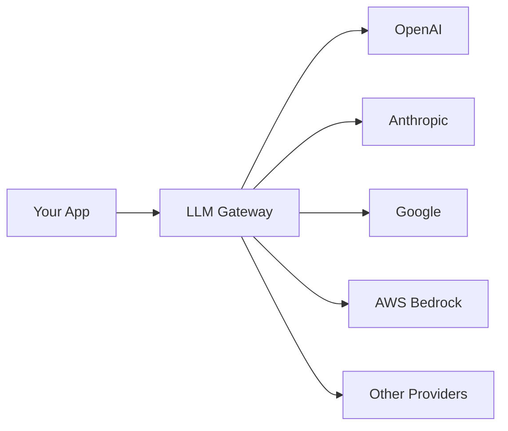

LLM Gateway is an open-source API gateway for Large Language Models that acts as middleware between your applications and various LLM providers. It provides a unified interface, usage analytics, and cost tracking across all your LLM interactions.

## What is LLM Gateway?

LLM Gateway sits between your application and LLM providers like OpenAI, Anthropic, Google, and AWS Bedrock. Instead of integrating with each provider separately, you make requests to the gateway using a unified OpenAI-compatible API, and it handles routing, authentication, caching, and logging.

## Key features

<CardGroup cols={2}>
  <Card title="Unified API" icon="plug" href="/features/unified-api">
    OpenAI-compatible API that works with all major LLM providers
  </Card>
  <Card title="Multi-provider support" icon="network-wired" href="/features/multi-provider">
    Connect to OpenAI, Anthropic, Google, AWS Bedrock, and more
  </Card>
  <Card title="Usage analytics" icon="chart-line" href="/features/analytics">
    Track requests, tokens, costs, and performance metrics
  </Card>
  <Card title="Response caching" icon="database" href="/features/caching">
    Reduce costs and latency with Redis-based caching
  </Card>
  <Card title="API key management" icon="key" href="/features/api-keys">
    Generate and manage API keys with fine-grained permissions
  </Card>
  <Card title="Rate limiting" icon="gauge" href="/features/rate-limiting">
    Control costs with token and request rate limits
  </Card>
  <Card title="Guardrails" icon="shield-halved" href="/features/guardrails">
    Implement content filters and safety policies
  </Card>
  <Card title="MCP integration" icon="plug-circle" href="/guides/mcp-integration">
    Connect with Model Context Protocol-compatible tools
  </Card>
</CardGroup>

## Architecture

LLM Gateway consists of two main services:

### Gateway API

The Gateway API provides OpenAI-compatible endpoints for making LLM requests:

- `POST /v1/chat/completions` - Chat completions with streaming support
- `POST /v1/images/generations` - Image generation
- `GET /v1/models` - List available models
- `POST /v1/messages` - Anthropic-native message format

All requests are logged, cached, and routed to the appropriate provider automatically.

### Management API

The Management API provides endpoints for managing your LLM Gateway instance:

- API keys and provider keys
- Projects and organizations
- Usage logs and analytics
- Guardrails and content filters
- Billing and credits

## Use cases

### Unified interface

Replace provider-specific code with a single OpenAI-compatible API. Switch between providers without changing your application code.

### Cost optimization

Track spending across all providers, identify expensive requests, and implement guardrails to control costs.

### Multi-provider fallback

Configure automatic fallback to alternative providers when your primary provider is unavailable or rate-limited.

### Analytics and monitoring

Monitor token usage, response times, error rates, and costs across all your LLM requests in a unified dashboard.

### Compliance and safety

Implement guardrails to filter sensitive content, detect PII, and prevent jailbreak attempts before they reach the LLM provider.

## Deployment options

### Hosted

The fastest way to get started is using the hosted version at [llmgateway.io](https://llmgateway.io). Create an account, get an API key, and start making requests immediately.

### Self-hosted

For complete control over your data and infrastructure, you can self-host LLM Gateway using Docker or Kubernetes. See the [self-hosting guide](/self-hosting) for detailed instructions.

## Getting started

<CardGroup cols={2}>
  <Card title="Quickstart" icon="rocket" href="/quickstart">
    Get up and running in 5 minutes
  </Card>
  <Card title="Self-hosting" icon="server" href="/self-hosting">
    Deploy on your own infrastructure
  </Card>
  <Card title="API reference" icon="code" href="/api-reference/gateway/overview">
    Explore the Gateway API
  </Card>
  <Card title="Integrations" icon="puzzle-piece" href="/integrations/openai-sdk">
    Use with your favorite SDK or framework
  </Card>
</CardGroup>

## Open source

LLM Gateway is open source and available on [GitHub](https://github.com/theopenco/llmgateway). The core functionality is licensed under AGPLv3, while enterprise features are available under a commercial license.

<Note>
Contributions are welcome! See the [Contributing Guide](https://github.com/theopenco/llmgateway/blob/main/CONTRIBUTING.md) to get started.
</Note>

## Next steps

<Steps>
  <Step title="Read the quickstart">
    Follow the [quickstart guide](/quickstart) to make your first API call in minutes.
  </Step>
  <Step title="Explore features">
    Learn about [caching](/features/caching), [analytics](/features/analytics), and [guardrails](/features/guardrails).
  </Step>
  <Step title="Integrate with your stack">
    See how to use LLM Gateway with [OpenAI SDK](/integrations/openai-sdk), [LangChain](/integrations/langchain), or [Vercel AI SDK](/integrations/vercel-ai-sdk).
  </Step>
  <Step title="Deploy to production">
    Review the [self-hosting guide](/self-hosting) and [enterprise features](/enterprise/overview) for production deployments.
  </Step>
</Steps>
